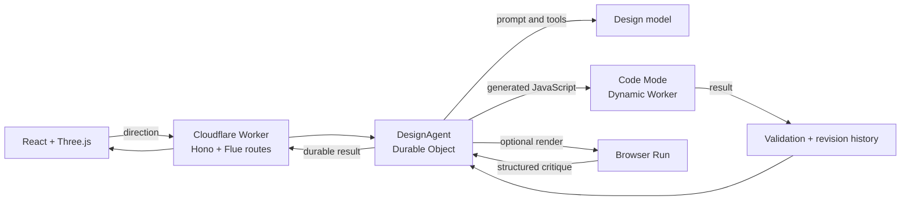

# Composer

> Experimental software. The hosted instance is intended to be private, and
> this code is not a production-ready, multi-tenant service.

Composer turns a conversation into an editable 3D sculpture. It is built with
[Flue](https://github.com/withastro/flue),
[Cloudflare Code Mode](https://github.com/cloudflare/codemode), React, and
Three.js.

Instead of generating an image—or letting the model write the renderer—the
agent writes a small, deterministic JavaScript function. Code Mode runs that
function in an isolated Dynamic Worker and returns a bounded list of 3D points.
The trusted Three.js renderer turns those points into an interactive sculpture.

## Run locally

You will need:

- Node.js 22.19 or newer. `.nvmrc` selects Node 24.
- A Cloudflare account with Dynamic Workers and Browser Rendering access.
- An OpenAI API key for the models selected in `wrangler.jsonc`.

```sh
git clone https://github.com/paperwing-dev/experiments.git
cd experiments/composer
nvm use
npm install
npx wrangler login
cp .env.example .env
```

Add your key to `.env`:

```dotenv
OPENAI_API_KEY=your-key-here
```

Start the app:

```sh
npm run dev
```

Open [http://localhost:5173](http://localhost:5173). Some Cloudflare bindings
run remotely during local development and may create billable usage.

Run the checks with:

```sh
npm test
npm run build
```

## What happens during a design turn

1. The React client sends a direction to a durable Flue conversation.
2. `DesignAgent` receives the conversation history, selected program, runtime
   parameters, and parameter schema.
3. The model either changes an exposed parameter or rewrites the program for a
   structural edit.
4. Code Mode runs the candidate program through a Worker Loader binding.
5. Application code validates the result before committing an immutable
   revision.
6. Three.js fits the returned points to a curve and builds the interactive tube
   mesh.

For an ambiguous aesthetic request, Browser Run can also capture one canonical
render for a structured visual critique. That critique may unlock one small,
grounded correction.



## Why Code Mode is useful here

Even a simple spiral contains many decisions: how quickly its radius grows, how
its height changes, whether it tapers, how it bends, and how densely it is
sampled.

With a fixed tool catalog, Composer would need `makeSpiral`, then more tools for
knots, waves, branches, distortions, and every way those forms might combine.
The application would slowly grow its own geometry language.

Code Mode lets JavaScript be that language. The model can use loops, formulas,
interpolation, and conditionals without the application predicting every useful
primitive. The sandbox keeps that creative range bounded: generated programs
receive no secrets, application bindings, host tools, or outbound network
access.

Every program returns the same narrow contract:

```ts
async ({ params }) => ({
  points: [{ x, y, z }, /* 8–500 total */],
  render: { radius, closed: false },
  parameterSchema: {
    turns: {
      type: 'number',
      label: 'Turns',
      default: 5,
      min: 1,
      max: 12,
      step: 0.25,
    },
  },
});
```

The agent generates geometry data, not scene code. The application still owns
validation, materials, lighting, framing, camera behavior, and mesh
construction.

## Architecture

| Layer | What it does |
| --- | --- |
| React and Three.js | Provides the conversation UI, revision browser, program viewer, and interactive renderer. |
| Flue | Owns the agent lifecycle, durable conversation, tools, persistent state, structured client events, retries, and optional visual-inspection harness. |
| Cloudflare Workers | Runs the Hono API, Flue routes, validation, and request protection. |
| Durable Objects with SQLite | Stores each Flue conversation, the immutable revision graph, and the small per-turn control state. |
| Dynamic Workers / Worker Loaders | Executes generated visual programs behind the Code Mode boundary. |
| Browser Rendering | Captures a fixed inspection render when the agent needs visual feedback. |
| Workers AI | Provides an optional `cloudflare/*` model path through the `AI` binding and AI Gateway. |
| Rate Limiting | Limits prompt, parameter-edit, and preview traffic by caller address. |

The checked-in deployment currently selects `openai/gpt-5.6-terra` for design
and inspection. Changing those variables to a `cloudflare/*` model routes
inference through Workers AI instead.

### Memory

Composer uses three durable memory layers:

- **Conversation memory:** Flue stores messages, model turns, tool calls, tool
  results, signals, and settlements in the conversation's Durable Object.
- **Artifact memory:** `designHistory` stores immutable program revisions,
  parameters, schemas, instructions, and parent links. Selecting an older
  revision and composing again creates a branch instead of deleting history.
- **Turn-control memory:** `designTurn` tracks the current candidate and the
  inspection/correction budget across retries and lifecycle continuations.

The selected source, parameters, and schema are placed back into the agent's
instructions on the next turn. This is what lets the model edit the current
piece instead of generating an unrelated replacement.

## Deploy

Store the production key once, then deploy:

```sh
npx wrangler secret put OPENAI_API_KEY
npm run deploy
```

`npm run deploy` builds the client and Worker before deploying the generated
Flue configuration.

This application assumes a private or otherwise trusted audience. Protect any
internet-facing deployment with
[Cloudflare Access](https://developers.cloudflare.com/workers/configuration/cloudflare-access/)
or add application-level authentication and authorization around the Flue
conversation routes.

For the Worker deployment, open **Workers & Pages → composer → Access**, protect
**All traffic**, and attach an allow policy for the intended email addresses.

## Security

Generated programs receive no secrets or network access. Normal execution is
limited to five seconds (two seconds for live previews), 20,000 source
characters, 8–500 finite points, coordinates within ±1,000, at most eight
numeric controls, and 80 KB of serialized output. A sandbox or validation
failure cannot append a revision or replace the selected artwork.

## Project notes

Implementation details, Flue integration findings, and end-to-end QA notes live
in [notes/flue-findings.md](notes/flue-findings.md).

## License

[MIT](LICENSE)
